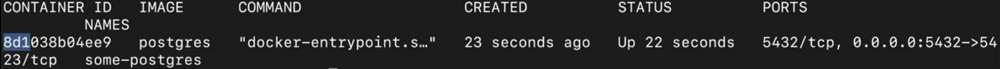
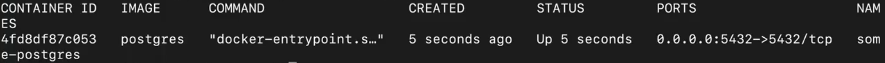
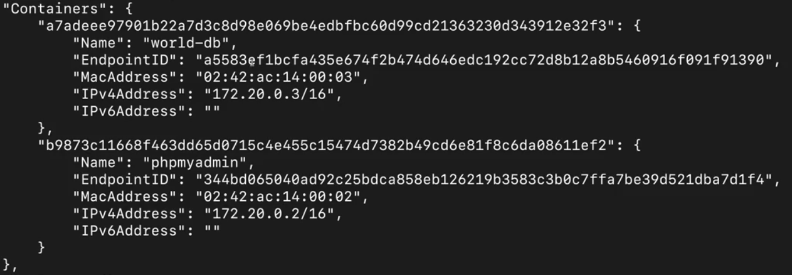
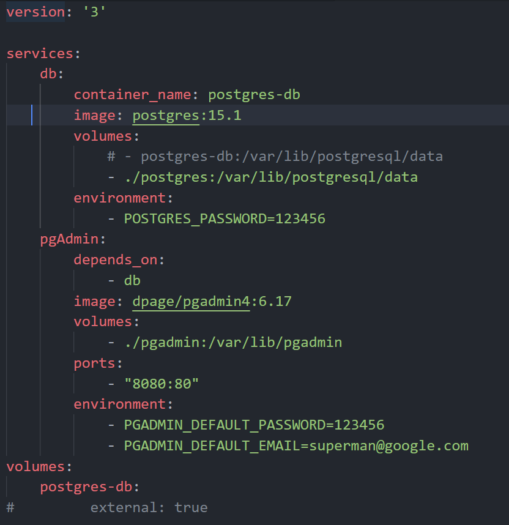

# Apuntes DOCKER

---

## Alpine - Linux

Es una distribución de Linux que es muy ligera y se utiliza mucho en contenedores de Docker, ya que esta orientada a la seguridad basada en musl libc y BusyBox. Es un linux con lo minimo y necesario para correr pero a la vez con todas las medidas de seguridad necesarias.

---

## Latest

Es una etiqueta (tag) que se utiliza para indicar que se quiere utilizar la ultima version de una imagen. Es una mala practica utilizar esta etiqueta ya que no se sabe que version se esta utilizando y puede traer problemas de compatibilidad en el futuro. Siempre es mejor utilizar una version especifica de la imagen.

Ademas en repositorios no oficiales, la imagen `latest` puede no ser la ultima version de la imagen.

---

## Puertos y Volumenes

### - Puertos

En un comando de Docker como este:
    
```
docker run -d -p 8080:80 docker/getting-started
```

El primer puerto (`8080`) es el puerto de mi equipo y el segundo puerto (`80`) es el puerto del contenedor. En este caso, el contenedor esta corriendo en el puerto 80 y lo mapeamos al puerto 8080 de mi equipo. 

Es necesario tener en cuenta cuales son los puertos que esta utilizando en el contenedor para poder mapearlos correctamente y saber cuales son los puertos que se estan disponibles en mi equipo para no tener conflictos.

Una forma de saber que puerto es el que expone el contenedor es ejecutando el comando `docker container ls` y en la columna `PORTS` se puede ver el puerto que esta utilizando el contenedor.


En este caso, el contenedor esta corriendo en el puerto 5432 pero no esta mapeado a ningun puerto de mi equipo. Al ejecutar el comando `docker run -d -p 5432:5432 postgres:12` se mapea el puerto 5432 del contenedor al puerto 5432 de mi equipo y aparece de esta forma:


### - Volúmenes

Los volumenes son una forma de persistir datos en Docker. Existen 3 tipos de volúmenes:

1. **Named Volumes**: volumenes que se crean con un nombre especifico y se pueden reutilizar en otros contenedores.
```
docker volume create world-db
```
Para utilizarlo en un contenedor se debe especificar el nombre del volumen:
```
docker container run `
-dp 3306:3306 `
--env MARIADB_USER=example-user `
--env MARIADB_PASSWORD=user-password `
--env MARIADB_ROOT_PASSWORD=root-secret-password `
--env MARIADB_DATABASE=world-db `
-v world-db:/var/lib/mysql `
mariadb:jammy
```
Notese que el path `/var/lib/mysql` es el path donde se guardan los datos de la base de datos en el contenedor. Al especificar el volumen `world-db:/var/lib/mysql` se esta guardando la base de datos en el volumen `world-db` y no en el contenedor. Si se elimina el contenedor, los datos de la base de datos se mantienen en el volumen. La sintaxis para crear un volumen es `nombre_volumen:path_contenedor`. Para saber cual es el "path_contenedor" se puede consultar la documentacion de la imagen que se esta utilizando.

2. **Bind Volumes**: volumenes que trabajan con paths absolutos. Sirven para vincular un directorio de mi equipo con un directorio del contenedor. Se pueden utilizar para compartir archivos entre mi equipo y el contenedor. Suele ser utilizado en desarrollo.
```
docker run -dp 3000:3000 `
-w /app `
-v "$(Get-Location)":/app `
node:18-alpine `
sh -c "yarn install && yarn run dev"
```

3. **Anonymous Volumes**: volumenes donde solo se especifica el path del contenedor y Docker lo asigna automaticamente en el host. Docker es el encargado de asignar el nombre del volumen.
```
docker run -v /var/lib/mysql/data
```

---

## - Variables de entorno (env)

En la ejecucion del `docker run` se pueden pasar variables de entorno con la bandera `-e` o `--env`. Por ejemplo:

```
docker run -d `
--network todo-app --network-alias mysql `
-v todo-mysql-data:/var/lib/mysql `
-e MYSQL_ROOT_PASSWORD=secret `
-e MYSQL_DATABASE=todos `
mysql:8.0
```

### ¿Que variables de entorno se pueden usar?

- Las que estan definidas por la imagen que se esta utilizando, es decir las variables de entornos que se estan esperando en el codigo.

---

## - Redes (networks)

**Regla de oro**: Si dos o mas contenedores necesitan comunicarse entre si, deben estar en la misma red. 

Es decir, suponiendo que tenemos un contendor de MariaDB (mariadb:jammy) que expone `-p 3306:3306` y otro contenedor de phpMyAdmin (phpmyadmin:5.2.0-apache). Notaremos que desde 'tableplus' o cualquier otro cliente de base de datos podremos conectarnos a la base de datos de MariaDB, pero no podremos hacerlo desde phpMyAdmin. Esto se debe a que los contenedores no estan en la misma red. 

**Nota importante**: Antes para conectar contenedores entre si, se utilizaba la bandera `--link` pero esta obsoleta y no se recomienda su uso.

En primer lugar, se debe crear una red:
```
docker network create <nombre_red>
```

Luego, se debe conectar los contenedores a la red:
```
docker network connect <nombre_red> <id/nombre contenedor>
```
Se podra verificar que los contenedores estan conectados a la red con el comando 
```
docker network inspect <nombre_red>
```
Donde deberiamos ver algo como esto:


### Asignar la red desde la inicializacion del contenedor
```
docker container run `
-dp 3306:3306 `
--name world-db ` 
--env MARIADB_USER=example-user `
--env MARIADB_PASSWORD=user-password `
--env MARIADB_ROOT_PASSWORD=root-secret-password `
--env MARIADB_DATABASE=world-db `
--volume world-db:/var/lib/mysql `
--network world-app `
mariadb:jammy
```
```
docker container run `
--name phpmyadmin `
-dp 8080:80 `
-e PMA_ARBITRARY=1 `
--network world-app `
phpmyadmin:5.2.0-apache
```

---

## - Docker Compose

Es una herramienta que permite definir y correr aplicaciones multi-contenedor. Se define en un archivo `docker-compose.yml` y se ejecuta con el comando `docker compose up`.

### - Sintaixis

- `version`: Esto define la version de la sintaxis de Docker Compose. 
- `services`: Aqui se definen los servicios que se van a correr. Cada servicio es un contenedor y los nombres pueden ser cualquiera.
- `image`: Especifica la imagen que se va a utilizar.
- `ports`: Especifica los puertos que se van a mapear.
- `volumes`: Especifica los volumenes que se van a utilizar.
- `enviroment`: Especifica las variables de entorno que se van a utilizar.
- `networks`: Especifica las redes que se van a utilizar.
- `depends_on`: Especifica que contenedores deben estar corriendo antes de que este contenedor se inicie. El nombre que se indica es el nombre del servicio y no del contenedor.
- `restart`: Especifica si el contenedor se debe reiniciar en caso de que falle. Los valores pueden ser `no`, `always`, `on-failure`, `unless-stopped`.
- `command`: Especifica el comando que se va a correr en el contenedor.
- `build`: Especifica la ruta donde se encuentra el Dockerfile.
    - `context`: Especifica la ruta donde se encuentra el Dockerfile.
    - `dockerfile`: Especifica el nombre del Dockerfile.
    - `target`: Especifica el nombre del stage que se va a construir.

Algunas consideraciones a tener en cuenta:
- Es necesario especificar cual sera el volume que se va a utilizar en el contenedor. Es decir, a la misma altura de `services` se debe definir el volumen que se va a utilizar.

En este caso, se esta pidiendo que se cree un volumen llamado `postgres-db`, sin embargo, la nomenclatura que utiliza Docker en este caso es `<project_name>_<volume_name>`, por lo que el volumen se llamara `todo-app_postgres-db`.
Para que Docker utilice el volumen ya existente `postgres-db`, se debe declarar con `external: true`. Si esto es una modificacion y no se hace por primera vez en la creacion del docker-compose, se debe eliminar el contenedor y volver a crearlo.

- No es necesario definir las redes, ya que Docker Compose crea una red por defecto para los servicios que se estan corriendo. 

- No confundir `docker compose build` con `docker compose up` ya que el primero construye las imagenes y el segundo levanta los contenedores.

- Es lo mismo usar en el Dockerfile `CMD` que `command` en el docker-compose.yml. 
