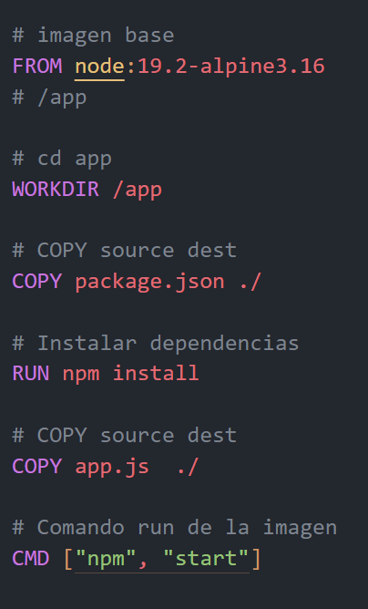

# Comandos DOCKER

---

## 1. docker container 

```
docker container --help
```

### - Ver contenedores

* En ejecución 
```
docker container ls
```

* Todos
```
docker container ls -a
```

### - LOGS de contenedores

* Ver logs 
```
docker container logs <id/nombre>
```

* Ver logs en tiempo real
```
docker container logs -f <id/nombre>
```

### - Eliminar contenedores

* Uno solo
```
docker container rm <id/nombre>
```

* Dos o más
```
docker container rm <id/nombre> <id/nombre>
```

* Todos
```
docker container prune
```

### - Detener o Eliminar contenedores

* Detener
```
docker container stop <id/nombre>
```

* Detener y eliminar 
```
docker container rm -f <id/nombre>
```

### - Ejecutar contenedores

* Iniciar
```
docker container start <id/nombre>
```

* Correr
```
docker container run --name "nombre del contenedor" <id/nombre>
```

---

## 2. docker image 

```
docker image --help
```

### - Ver imagenes

* En ejecución 
```
docker image ls
```

* Todos
```
docker image ls -a
```

### - Eliminar imagenes

* Una sola
```
docker image rm <id/nombre>
```

* Dos o más
```
docker image rm <id/nombre> <id/nombre>
```

* Todas las que no estan identificadas
```
docker image prune
```

* Todas
```
docker image prune -a
```

---

## 3. docker volume

```
docker volume --help
```

### - Ver volumen

* En ejecución 
```
docker volume ls
```

* Todos
```
docker volume ls -a
```

### - Crear volumen

```
docker volume create <nombre>
```

### - Ver información de un volumen

```
docker volume inspect <nombre>
```

---

## 4. docker network

```
docker network --help
```

### - Ver redes

* En ejecución 
```
docker network ls
```

* Todas
```
docker network ls -a
```

### - Crear red

```
docker network create <nombre>
```

### - Conexion con contenedores

```
docker network connect <id_red/nombre_red> <id/nombre>
```

### - Ver información de red

```
docker network inspect <nombre>
```

---

## 5. docker exec

```
docker exec --help
```

### - Terminal interactiva

* Entra
```
docker exec -it <id/nombre> <bash - /bin/sh>
```

* Ver variables de entorno
```
docker exec <nombre_del_contenedor> env
```

* Salir
```
exit
```

---

## 6. docker compose

* Levantar docker-compose
```
docker-compose up
```

* Levantar docker-compose en segundo plano
```
docker-compose up -d
```

* Detener docker-compose
```
docker-compose down
```

* Construir las imagenes
```
docker-compose build
```

---

## 7. Dockerfile

* Crear imagen
```
docker build --tag SOURCE[:tag] .
```

* Crear una imagen con distintos tipos de arquitectura
```
docker buildx build `
--platform linux/amd64,linux/arm64 `
-t nachodocker1714/cron-ticker:builds --push .
```

* Renombrar imagen
```
docker tag SOURCE[:tag] TARGET_IMAGE[:tag]

* Subir una imagen
```
docker push SOURCE[:tag]
```

* Explicar Dockerfile



En esta imagen se puede observar un ejemplo de un Dockerfile. En estos tipos de archivos se escriben instrucciones para crear una imagen de Docker. Se puede observar las siguentes instrucciones: 

1. "FROM node:19.2-alpine3.16": indica la imagen base que se va a utilizar, en este caso se esta utilizando la imagen de node en la distribución de Linux Alpine.

2. "WORKDIR /app": dentro de esta imagen base, existen varios directorios como "/app", "/usr", "/lib", etc. En este caso, se esta navegando al directorio "/app".

3. "COPY package.json ./": copia el archivo "package.json" del directorio local al directorio "/app" de la imagen.

4. "***RUN*** npm install": ejecuta el comando "npm install" en la imagen.

5. "COPY app.js ./": copia el archivo "app.js" del directorio local al directorio "/app" de la imagen. En este caso se encuentra separado de la instruccion "COPY package.json ./", ya que si se modifica el archivo "app.js" no se necesita instalar las dependencias nuevamente.

6. "CMD ["npm", "start"]": indica el comando que se va a ejecutar cuando se inicie un contenedor a partir de esta imagen.


